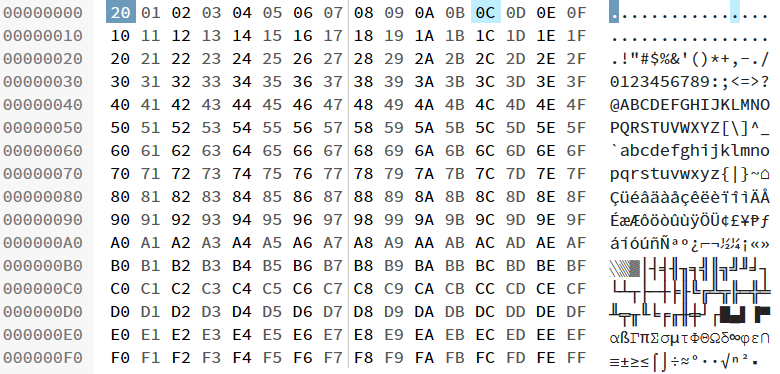

# How the Put Statement acts:

To find out how to input bytes of data into files we need to do an analysis of the data returned from each of the file writing statements.

## `Logical` data-type:
Documented as being able to insert single bytes of data. Any non-zero character written to a file from a logical variable, will be inputted as `00000001`. Logical values of 0 will be inputted as `00000000`.

Example:

```
Dim fs as string
fs = "C:\Users\jwa\Desktop\TBD\MiWrite\hello.txt"

Dim k as Logical
Open File fs for binary as #1
    k=asc("H")
    Put #1,1,k
    k=asc("e")
    Put #1,1,k
    k=asc("l")
    Put #1,1,k
    k=asc("l")
    Put #1,1,k
    k=asc("o")
    Put #1,1,k
Close File #1  
```

File Contents:

```
01
01
01
01
01
```

## `Integer` data-type

Documented as being able to insert 4 bytes of data at a time. I would assume this would mean that every number that is written is will write 4 bytes of data. E.G. writing `5` would write `00000000 00000000 00000000 00000101`. However this is not the case. Here's an example:

```
Dim fs as string
fs = "C:\Users\jwa\Desktop\TBD\MiWrite\hello.txt"

Dim k as Integer
Open File fs for binary as #1
    k=asc("H")
    Put #1,1,k
    k=asc("e")
    Put #1,1,k
    k=asc("l")
    Put #1,1,k
    k=asc("l")
    Put #1,1,k
    k=asc("o")
    Put #1,1,k
Close File #1  
```

If I look at the file in a Hex Editor, we can see the following bytes.

```
48 'H
65 'e
6c 'l
6c 'l
6f 'o
00 'null
00 'null
00 'null
```

## `SmallInt` data-type

Documented as being able to insert 2 bytes of data at a time.  However as above, it appears to only print 1 byte at a time here except for the last character... Here's an example:

```
Dim fs as string
fs = "C:\Users\jwa\Desktop\TBD\MiWrite\hello.txt"

Dim k as smallint
Open File fs For Binary as #2
	k = asc("h")
	Put #2,1, k
	k = asc("e")
	Put #2,2, k
	k = asc("l")
	Put #2,3, k
	k = asc("l")
	Put #2,4, k
	k = asc("o")
	Put #2,5, k
Close File #2
```

If I look at the file in a Hex Editor, we can see the following bytes.

```
68 'h
65 'e
6C 'l
6C 'l
6F 'o
00 'null
```

On further inspection this makes a lot of sense:

```
1st write:
68 'h
00 'null

2nd write (at position 2):
68 'h
65 'e
00 'null

3rd write (at position 3):
68 'h
65 'e
6C 'l
00 'null
```

After execution the file is also in a Read-Only state...?

## `Float` data-type

As one would expect `Float` is not the best datatype to store bytes of data. However for completeness I tested it anyway:

```
Dim fs as string
fs = "C:\Users\jwa\Desktop\TBD\MiWrite\hello.txt"

Dim k as float
Open File fs For Binary as #2
	k = asc("h")
	Put #2,1, k
	k = asc("e")
	Put #2,2, k
	k = asc("l")
	Put #2,3, k
	k = asc("l")
	Put #2,4, k
	k = asc("o")
	Put #2,5, k
Close File #2
```

Produces:

```
00 'null
00 'null
00 'null
00 'null
00 'null
00 'null
00 'null
00 'null
00 'null
C0 'À
5B '[
40 '@
```

## `Date` data-type

Once again, the Date data-type is unlikely to be a good method to store data, but just in case...

```
Dim fs as string
fs = "C:\Users\jwa\Desktop\TBD\MiWrite\hello.txt"

Dim k as date
Open File fs For Binary as #2
	k = asc("h")
	Put #2,1, k
	k = asc("e")
	Put #2,2, k
	k = asc("l")
	Put #2,3, k
	k = asc("l")
	Put #2,4, k
	k = asc("o")
	Put #2,5, k
Close File #2
```

Produces:

```
00
00
00
00
00
00
01
0B
```

## `String` data-type

Most likely the best data-type to use to write bytes, as long as the last null character is ignored.

```
Dim fs as string
fs = "C:\Users\jwa\Desktop\TBD\MiWrite\hello.txt"

Dim k as string*1    '<--- *1 is very important here. It tells MI that we want to write strictly 1 character!
Open File fs For Binary as #2
	k = "h"
	Put #2,1, k
	k = "e"
	Put #2,2, k
	k = "l"
	Put #2,3, k
	k = "l"
	Put #2,4, k
	k = "o"
	Put #2,5, k
Close File #2
```

As assumed this is the best way to store files as shown:

```
68 'h
65 'e
6C 'l
6C 'l
6F 'o
```

The strange thing about this result is that, in the documentation it claims: 

```
Variable Type | Storage In File
String        | Storage in FileLength of string plus a byte for a 0 string terminator`
```

Yet the file shown in the case above doesn't have the 0 string terminator...?

I suggest this is due to the datatype `string*1`. One way to observe this is if we increase the length to 2: `string*2`

```
Dim fs as string
fs = "C:\Users\jwa\Desktop\TBD\MiWrite\hello.txt"

Dim k as string*2
Open File fs For Binary as #2
	k = "h"
	Put #2,1, k
	k = "e"
	Put #2,2, k
	k = "l"
	Put #2,3, k
	k = "l"
	Put #2,4, k
	k = "o"
	Put #2,5, k
Close File #2
```

Bytes produced:

```
68 'h
65 'e
6C 'l
6C 'l
6F 'o
20 'DC0/DLE (Data Link Escape)
```

# Put ALL characters

Assuming that characters are the best way to go, to make sure we have to write all characters to a file and make sure they all are correct. In the end, MapInfo may write some characters down incorrectly to their true values.

```
Dim fs as string
fs = "C:\Users\jwa\Desktop\TBD\MiWrite\hello.txt"

Dim k as string*1
Open File fs For Binary as #2
	Dim i as integer
	For i = 0 to 255
		k = chr$(i)
		Put #2,i+1, k
	Next
Close File #2
```



As we can see from the image it was a good thing we tested this since the first character we print `chr$(0)` isn't `00` as we'd expect, but instead it's `20`. This implies that when exporting files we will need an if statement like the following:

```
If hex = "00" Then
	Dim k as SmallInt
	k = 0
	Put #1, k
Else
	Dim k as string*1
	k=Hex2Chr$(hex)
	Put #1, k
End If
```
